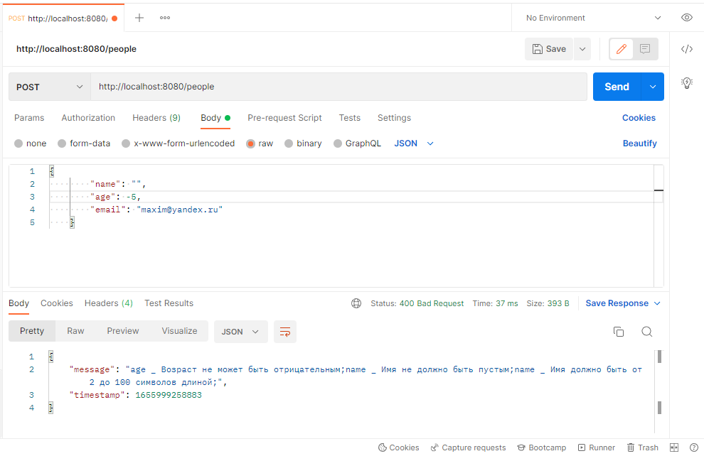

# Spring Boot REST API

## Описание
REST API для получения и изменения информации о пользователях в БД в виде JSON. Реализует взаимодействие посредством HTTP протокола. Обрабатывает HTTP запросы, использующие методы:

| HTTP метод | URL         | CRUD операция                       |
|------------|:------------|:------------------------------------|
| GET        | people      | Получение всех пользователей        |
| GET        | people/{id} | Получение одного пользователя по ID |
| POST       | people      | Добавление пользователя             |
| PUT        | people      | Изменение пользователя              |
| DELETE     | people/{id} | Удаление пользователя               |

---

## Технологии
Java 8, Spring Boot, JPA, JSON, MySQL, Validation

Для проверки правильности работы каждого метода использовался Postman

---

## Запуск

1. Клонировать репозиторий:
   
   ```git 
   git clone https://github.com/M-Magomedov/Rest-App.git
   ```

2. Собрать проект с помощью Maven
   ```
   mvn clean install
   ```

3. Настроить конфигурацию подключения к БД
   
Файл [application.properties](F:\GitHub Magomed\RestApp\src\main\resources\application.properties) позволяет вносить и изменять параметры по умолчанию.
```java

spring.datasource.url=jdbc:mysql://localhost:'port'/'your_db'?useSSL=false&serverTimezone=UTC     
spring.jpa.properties.hibernate.dialect = org.hibernate.dialect.MySQL5Dialect
spring.datasource.username=
spring.datasource.password=
spring.jpa.show-sql=true
spring.jpa.hibernate.ddl-auto=update

```
4. Запустить приложение и открыть Postman
   
```
cd RestApp
mvn spring-boot:run
```
5. Открыть Postman

## Получение всех пользователей


## Получение одного пользователя по Id


## Добавление пользователя


## Изменение пользователя


## Удаление пользователя


## Ошибка, когда пользователь не найден


## Валидация данных



